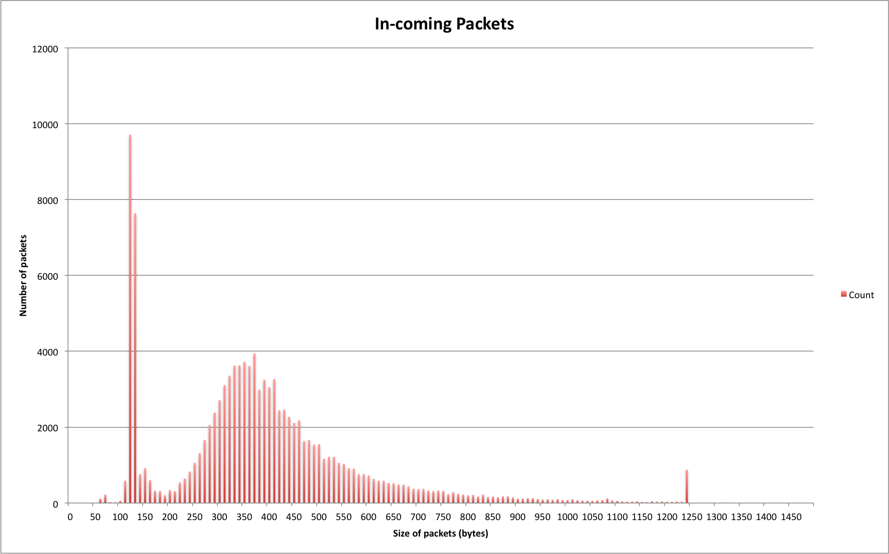
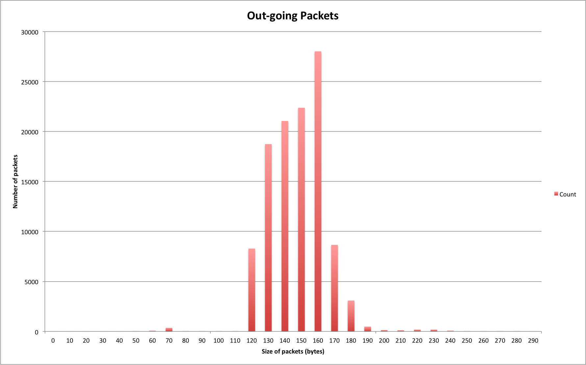
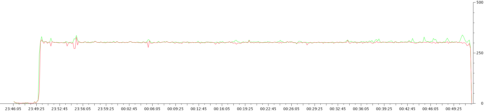
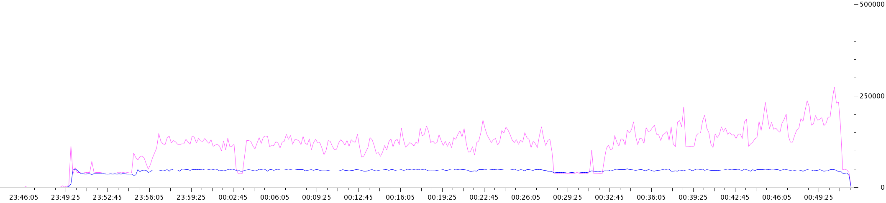
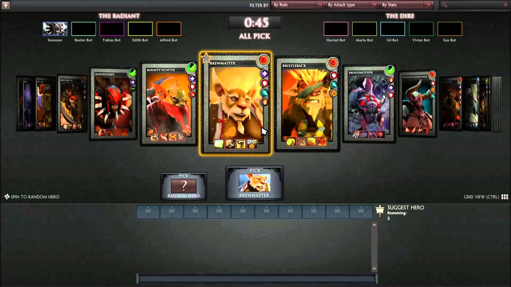

CS4344 Assignment 1
==
---------------------------------------

## Understanding Game Traffic

Semester 2, 2014/15

**A0073063M**

**Tay Yang Shun**  
[tay.yang.shun@gmail.com]()

### 1. Experimental Setup

##### The Game

*Say something about the game you pick, describe how it is played.*

Dota 2 is a multiplayer game for the desktop that falls under the Multiplayer Online Battle Arena (MOBA) genre. It is available exclusively through Valve’s content delivery platform, Steam. In Dota 2, each match consists of two teams of five players, and each team has a base at one corner of the map. In each base, there lies an “Ancient”, a building which the opposing team must destroy to win the match.

Each player selects a character hero 

##### The Experiment
Describe in details how you collect the packets (on what platform, how many players, what did you do in the games, etc. etc.)

### 2. Basic Characteristics of the Game Traffic

| Type    | Total bytes | Total packets |
|---------|-------------|---------------|
|In-coming|  44237094   |    113262     |
|Out-going|  16992908   |    111940     |

**Total capture duration:** 3551.43 seconds

##### Average Throughput
*What are the average in-coming and out-going throughput (bytes / second)?*

| Type    | Average throughput (bytes/s)      |
|---------|-----------------------------------|
|In-coming| 44237094 / 3551.43 = **12456.13** |
|Out-going| 16992908 / 3551.43 = **4784.80**  |

##### Average Packet Load
*What are the average in-coming and out-going packet load (number of packets / second)?*

| Type    | Average packet load (packets/s) |
|---------|---------------------------------|
|In-coming| 113262 / 3551.43 = **31.89**    |
|Out-going| 111940 / 3551.43 = **31.52**    |

##### Transport Protocol
*What are the transport protocols used? (UDP, or TCP, or both?)*

Both TCP and UDP were used at different phases of the game.

Within the game, there were certain screens  that were embedded webpages. In the matchmaking room, user avatars/profile pictures are also shown. These webpages and avatar content were fetched over HTTP via TCP.

As soon as the ten players were matched and after the game started, UDP was the only transport protocol used. 

##### Connections
*How many connections do you see?*

There were three connections:

- Connection 1:
	- TCP conection between `172.30.26.132` port `63233` and `202.51.247.237` port `80`. 
- Connection 2:
	- UDP connection between `172.30.26.132` port `50784` and `103.28.54.103` port `27020`.
- Connection 3:
	- UDP connection between `172.30.26.132` port `56284` and `103.28.54.10` port `27018`.

### 3. Distribution of Payload Sizes

*What are the distributions of the payload size for in-coming and out-going packets? (Plot a histogram) What is the average payload size?*

##### In-coming Packets

**Figure 1**: *Number of packets* against *Size of packets* for in-coming traffic

Average payload size for in-coming packets  
= Total payload size / Number of packets  
= 44237094 / 113262  
= **390 bytes**

##### Out-going Packets

**Figure 2**: *Number of packets* against *Size of packets* for out-going traffic

Average payload size for out-going packets  
= Total payload size / Number of packets  
= 16992908 / 111940  
= **151 bytes**

### 4. Traffic Patterns

*Any patterns observed when the game activity changes?*

In Dota, there are these phases in the game: (i) Matchmaking, (ii) Loading, (iii) Hero Selection, (iv), Laning, (v) Ganking, (vi) Pushing, (vii) End. A description about the game phases and the activity involved will be given followed by the network traffice patterns observed in each of these phases.

**Figure 3**: *Number of packets* against *time*. The green line indicates in-coming traffic while the red line indicates out-going traffic. A tick interval of 10 seconds was used in the generation of the graph.

**Figure 4**: *Size of packets* against *time*. The pink line indicates in-coming traffic while the blue line indicates out-going traffic. A tick interval of 10 seconds was used in the generation of the graph.

The two figures above show the number of packets and size of UDP packets sent out and received for the whole duration of the game. 

##### i. Matchmaking Phase (2346 hrs to 2349 hrs)

Matchmaking phase was from 2346 hrs to 2349 hrs. This phase involves the user clicking on the **Find Match** button and waiting for the game servers to respond with an indication that a match was found. The packets throughput and data throughput for this phase is relatively low and no fluctuations were observed.

##### ii. Loading Phase (2350 hrs to 2351 hrs)

After a match has been found, the player is given the option to **Accept** or **Decline** the match. Once all ten selected players have chosen **Accept**, the player is shown a loading screen. This happens at around 2350 hrs. The UDP packet throughput in Figure 3 and data throughput in Figure 4 can be seen to increase from 2350 hours onwards.

In Figure 3, UDP traffic was low originally, but after the game started at 2350 hours, both in-coming and out-going number of UDP packets increased to around 300 packets per 10 seconds, and steadily remained at that rate for the whole duration of the game, with brief fluctuations. The data throughput of both in-coming and out-going traffic increased from a negligible value to 5000 bytes/s.

##### iii. Hero Selection Phase (2351 hrs to 2355 hrs)

After the loading screen, the player will be presented the hero selection screen. Players take turns to select a hero from a list of 100 over heroes available. 

**Figure 5**: Dota 2 Hero Selection Screen

The average data throughput of the in-coming and out-going traffic was approximately the same in this phase at around 5000 bytes/s. This is because at this point of the game, content is mostly static and there is virtually no action. The only user input possible is to scroll through the list of heroes, select a hero, or type chat messages. The out-going data traffic remained at 5000 bytes/s for the remaining of the game.

##### iv. Laning Phase (2356 hrs to 0015 hrs)

After all players have selected their hero, they are brought into the 3d game world. At this point, the players have control over their heroes and can execute a few actions: movement, attack, use items. Minions will spawn at every 30 seconds and move in a pre-determined route along 3 lanes. At the start of the game, heroes start at level 1 and have not learnt any skills. Players would have to go to their lanes and kill the opponent minions. In this phase, there isn't much interactive action between players.

In this phase, the average data throughput of the in-coming traffic has increased to around 12500 bytes/s. This is because this phase, the game state consists of more information, such as the positions of the various units on the map, the actions, and hero details (gold, inventory, level, etc). Fluctuations are small in this phase.

At around 0003 hours, there was a dip in the in-coming data traffic, which is due to a brief pausing of the game. This phenomenon will be explained in detail in a separate section below.

##### v. Ganking Phase (0015 hrs to 0032 hrs)

When heroes have reached level 6, they gain the ultimate ability, which is a powerful ability unique to each hero. From this point onwards, many players stop staying in lane to farm, they roam around the map, trying to kill the opponent heroes with the help of their allied heroes. This is called ganking (ganging and killing). Team clashes happen frequently in this phase.

In this phase, large fluctuation of the data throughput of the out-going traffic can be observed. When players control their heroes to fight, the player has to input many actions: activating hero skills, using hero items, moving their heroes around and clicking on enemy heroes to attack. This increase in frequency of player input will cause a sudden increase in the amount of information that the server needs to send to players in the game. Also, a fight involves a few heroes, and hence the server receives more inputs from the players controlling these heroes. Cumulatively, this increased frequency of inputs from a few players result in an increase in the in-coming data traffic, for the period of each clash, each player receives more updates of the game state from the game servers.

In each battle, some heroes will end up dead and a respawn timer is set off. In this period of time, the hero does not exist in the game and there is nothing much that the player can do, except to wait for their hero to respawn. The in-coming data traffic will drop at this point. Hence after every battle between heroes, there will be a drop in the in data throughout of the in-coming network traffic.

From around 0028 hrs to 0032 hours, the in-coming data traffic was low, almost at the same rate as the out-going data traffic. This was due to another pausing of the game, which will also be explained in detail in a separation section below.

##### vi. Pushing Phase (0036 hrs to 0050 hrs)

Heroes are around level 16 at this point, and they have learnt all their available skills and purchased many actionable items. The usual behaviour of players in this phase would be to stick together in a team and attack the opponent's base together. The act of attacking the opponents guard towers is called pushing.

*Any periodic patterns observed in the traffic?*

### 5. Conclusion

*Summarize the major lessons you observe in this game traffic patterns.*

- Input from players barely cause any difference in the out-going game traffic.
- No Interest management. All players receive the information of the whole game world.